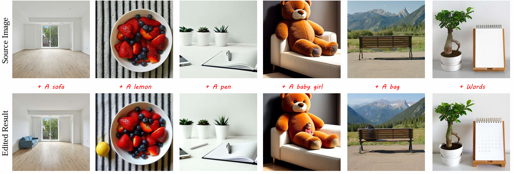

<div align="center">
  
# CausalEdit: Causal Inference for Unbiased Training-Free Text-Conditioned Visual Editing

[Yongwen Lai](https://openreview.net/profile?id=~Yongwen_Lai1)<sup>1</sup>,
[Chaoqun Wang](https://openreview.net/profile?id=~Chaoqun_Wang3)<sup>1</sup>,
[Haoxiang Cao](https://openreview.net/profile?id=~Haoxiang_Cao1)<sup>1</sup>,
[Shaobo Min](https://openreview.net/profile?id=~Shaobo_Min2)<sup>2</sup>,
[Yu Liu](https://openreview.net/profile?id=~Yu_Liu57)<sup>3</sup>,

<sup>1</sup> South China Normal University,  <sup>2</sup> University of Science and Technology of China,  <sup>3</sup> Hefei University of Technology


<div align="left">

<p>
We propose a flow trajectory sampling strategy that constructs proxy inputs by interpolating latents along the linear transport path between the source latent and a synthetic target latent. 
Then, an interventional velocity fusion mechanism is designed to aggregate predicted velocities conditioned on the sampled latents, thereby producing less biased outputs than previous methods.
Extensive experiments demonstrate that <strong>CausalEdit</strong>  significantly improves editing controllability and fidelity, highlighting the effectiveness of causal modeling for the visual editing task.
</p>

<div align="center">


# 📸 Image Editing
<p align="center">

</p>

<p align="center">

</p>

<p align="center">

</p>

<p align="center">

</p>

# 🎥 Video Editing
<p align="center">

</p>

<p align="center">

</p>

# 🛠️ Code Setup
The environment of our code is the same as FLUX, you can refer to the [official repo](https://github.com/black-forest-labs/flux/tree/main) of FLUX, or running the following command to construct the environment.


<div align="left">

```
conda create --name CausalEdit python=3.10
conda activate CausalEdit 
pip install -r requirements.txt
python inference.py
```

<div align="center">

# Contact
The code in this repository is still being reorganized. Errors that may arise during the organizing process could lead to code malfunctions or discrepancies from the original research results. If you have any questions or concerns, please send emails to 2024025439@m.scnu.edu.cn.
